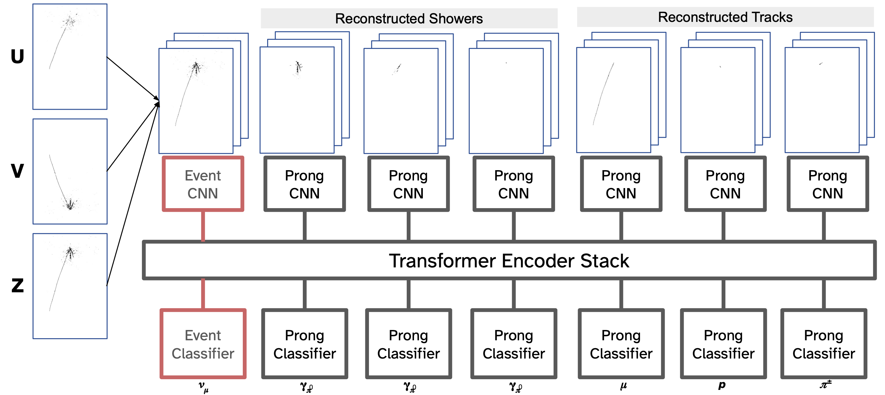

# TransformerCVN Tutorial
Credit: [@Alexanders101](https://github.com/Alexanders101)

This repository serves as a tutorial the TransformerCVN network for simultaneous event and particle classification presented during the DUNE AI/ML workshop at Fermilab on April 29, 2025. It introduces how to train a network in pytorch with the pytorch-lighting framework and also includes tools for testing the trained network and compiling the network into a torchscript file for use in C++.

For each event, the network takes as input pixel map images corresponding to the overall event in addition to pixel maps for each reconstructed prong (track or shower) found in the event. Prong pixel maps only contain hits assigned to a particular prong by an upstream prong reconstruction algorithm such as [Pandora](https://github.com/DUNE/dunereco/tree/develop/dunereco/DUNEPandora).
Each pixel map is 3 x 400 x 280 inheriting from the choice of image dimensions for the [RegCNN](https://github.com/DUNE/dunereco/tree/develop/dunereco/RegCNN) network for numu energy regression.

The network outputs event classification scores as well as prong classification scores for each input prong pixel map.   
Event Classes: ["Numu Charged Current", "Nue Charged Current", "Neutral Current", "Other"]   
Prong Classes: ["Electron", "Muon", "Proton", "Photon from Neutron", "Charged Pion", "Photon from Neutral Pion", "Other Photon", "Other"]   



# EAF
This tutorial will use the Fermilab Elastic Analysis Facility (EAF) but can be run elsewhere, preferably with CUDA-supported GPUs. Instructions for using an EAF server are available [here](https://mu2ewiki.fnal.gov/wiki/Elastic_Analysis_Facility_(EAF)). A Fermilab Services account is required as well as either a Fermilab VPN connection or a browser proxy as detailed in the linked instructions.

Start a server by selecting the DUNE GPU option. The training parameters in this tutorial have been tuned to work on the smaller 10GB nodes. These nodes have access to the `/exp/dune/app/` and `/exp/dune/data` directories.
Source the python virtual environment.
```
source /exp/dune/data/users/ayankele/transformercvn_env/bin/activate
```
In order to use this environment through the EAF jupyter notebook launcher, this kernel must be added first.
```
python -m ipykernel install --user --name=transformercvn_env
``` 

# Training
Clone this repository.
```
git clone https://github.com/ayankele/dune-transformercvn.git
cd dune-transformercvn
```

To start the training, run 
```
python train.py -o "path of the option file" -n "create a name for your training"
```
For example, `python train.py -o option_files/fdhd_beam_2018prod_aiml_tutorial_2025_04_21.json -n tutorial_dense`

The option file is a required argument, and example option files are located in `option_files`. A description of each option is available in `transformercvn/options.py`. Among these are:  

`training_file`: Path to the training file  
`validation_file`: Optional path to the validation file  
`train_validation_split`: 0-1. If `validation_file` is not specified, this fraction of the dataset is randomly selected for training with the rest for validation.  
`num_gpu`: Number of available GPUs. 0 will use the CPU.  
`batch_size`: Number of events per batch at each training step.

Some options can be overridden through command-line arguments. Use `python train.py --help` for more information.

This repository supports different architectures for the CNNs responsible for embedding the pixel maps into the transformer. The default and the one we use in this tutorial is a DenseNet CNN.  
Add the argument `--sparse` to use a network with sparse convolutions. Note that this network cannot be exported to torchscript.   
Use `--sdxl` to use a Stable Diffusion XL inspired CNN with self-attention layers. This is the network we use in the LArSoft module.

The data we will use as specified in the example option file is in `/exp/dune/data/users/ayankele/fdhd_beam_2018prod_prong_pixels_minkowski_sparse.h5`

By default, a cosine learning rate schedule with warmup will be used and can be adjusted in the options file. The period of a cycle in epochs is `epochs` / `learning_rate_cycles`. Setting `learning_rate_cycles: 0` will use a decaying learning rate.

# Stopping and Resuming Training
Starting training will create a folder with the specified name and a subfolder `version_0`. Training can be stopped with Ctrl-C. Stopping at the end of an epoch is preferred since resuming will rerandomize the sequence of training events for the epoch. Subsequent trainings with the same name will increment the version number.
To resume training, add the argument `-c "path to model checkpoint"`.

# Testing
The jupyter notebook [Evaluate.ipynb](Evaluate.ipynb) can be used to both monitor training and to test a trained network.  
The "Training History" section will read the specified tensorboard created during training and plot several metrics as a function of training step. Metrics with the word `train` are saved each training step, and others are saved at the end of each validation run. There are separate metrics for event and prong classification performance. Metrics with `val` refer to the simple average of the corresponding event and prong metrics. The learning rate schedule can also be plotted here.

The "Testing" section will run the network against the specified dataset. For this tutorial, we will use the validation set, but a separate file conatining a testing set can be specified as `TESTING_FILE`.
This is followed by several testing metrics and plots such as ROC curves and confusion matrices.

# Compiling the network
The [CreateCompiled.ipynb](CreateCompiled.ipynb) jupyter notebook can be used to compile the network into a torchscript file for use in the C++ LArSoft ART framework. Modify the paths in the second cell to point to the directory and checkpoint of the model you want to export.
The final cell will create three torchscript files. All three models take as input a single tensor with the shape [(1+Npng), 3, 400, 280] where the first 3x400x280 image corresponds to the event pixel map followed by the prong pixel maps.   

The file ending in `pid` outputs a tuple of 2 tensors. The first tensor gives the softmax scores corresponding to the event classes. The second tensor is Npng x 8, corresponding to the prong softmax scores in the order that they were input.  

The file ending in `embeddings` also outputs a tuple of 2 tensors. Rather than the final event/prong predictions, this model outputs the intermediate feature representation vectors that are output by the transformer and serve as input into the classification layers. The first tensor has length 128 and corresponds to the event feature representation, and the second tensor is Npng x 128 and corresponds to the prong feature representations.  

The file ending in `combined` gives all of the above outputs as a tuple of 4 tensors: event prediction, prong predictions, event embedding, prong embeddings.  

# Data Format

This tutorial does not cover preparation of a training dataset, but the h5 data format is described below. Pixel maps are stored in a sparse format. We set a limit of 20 prongs per event for training.

| Branch Name | Shape | Description |
| :-- | :--- | :-- |
| `event_target`  | (Nevt,)  | Event class labels, (0-3)=NumuCC, (4-7)=NueCC, 13=NC, 15=Other |
| `prong_target`  | (Nevt,&#160;20)  | Prong class labels following above definitions for up to 20 prongs. Events with fewer than 20 prongs are padded with -1.|
| `prong_mask`  | (Nevt,&#160;20) | 0 if `prong_target==-1`, else 1 |
| `full_pixels_shape` | (3,) | [3, 400, 280] |
| `event_pixels_shape` | (4,) | [1, 3, 400, 280] |
| `prong_pixels_shape` | (4,) | [20, 3, 400, 280]  |
| `event_pixels_coordinates` | (NevtHits,&#160;3) | Coordinates of nonzero pixels in event pixel maps: [0, (0-399), (0-279)] |
| `prong_pixels_coordinates` | (NpngHits,&#160;3) | Coordinates of nonzero pixels in prong pixel maps: [(0-19), (0-399), (0-279)] |
| `event_pixels_value` | (NevtHits,&#160;2) | Corresponding pixel values in event pixel maps for [X-view, Y-view] |
| `prong_pixels_value` | (NevtHits,&#160;2) | Corresponding pixel values in prong pixel maps for [X-view, Y-view] |
| `features` | (Nevt,&#160;20,&#160;NpngVars) | Unused, can be used to input prong-level reconstructed variables |
| `extra`    | (Nevt,&#160;NevtVars)          | Unused, can be used to input event-level recontructed variables |
| `event_compressed_index` | (Nevt,&#160;2) | [First, Last] index in `event_pixels_coordinates` and `event_pixels_value` corresponding to a particular event |
| `prong_compressed_index` | (Nevt,&#160;2) | [First, Last] index in `prong_pixels_coordinates` and `prong_pixels_value` corresponding to a particular event |

The `features` and `extra` branches are currently unused, but they can be used to input reconstructed variables along with the pixel maps.  
The event class labels within the NumuCC class, for example, refer to the interaction modes. 0=quasielastic, 1=resonant, 2=deep inelastic scattering, 3=other. We currently do not train to identify interaction modes, but this can be enabled by setting `event_current_targets: False`.

